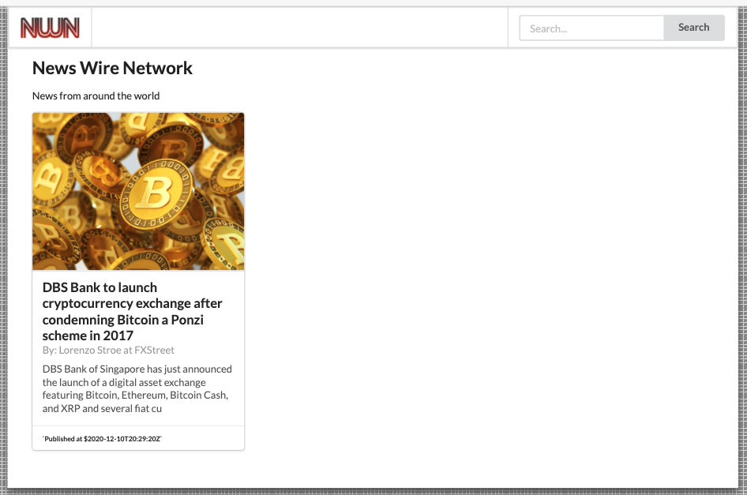

## NWN - News Wire Network Challenge

Welcome to the NWN challenge. This is a teke-home retake of the midcourse exam.

We want to see clean, DRY, well scoped and well tested code, a good git strategy (small, well described commits that allow us to follow your workflow), good use of the included libraries and overall a standard that will allow us to determine your level of ambition and skill.

**Your task is to finish developing this small app that is supposed use the News API (newsapi.org) and display the latest headlines from various news organizations from around the world.**

The lead (and only) developer that worked on this project, contracted a dangerous virus and had to be put in quarantene. For some reason, you can not get hold of her to ask for any support even if you need to. However, you know that her work is usually of good quality, and can be pretty sure of that there is no need to make any big changes or refactorings to the setup or structure of the application itself. You can instead focus on moving forward, and implement the desired.  functionality.

When loaded, the user should see "Top Headlines" and be allowed to search for news that interest her/him.

1. Make use of Cypress to test your application
2. Use functional components
3. Use redux to store the news in centratized state
4. Make use of `useSelector`, `useDispatch`, `useEffect` and potentially `useState` hooks.

Please note that you have to sign up for the service (it is free) and carefully read through the documentation (https://newsapi.org/docs/).

Your submission needs to be a Pull Request to this repository.

